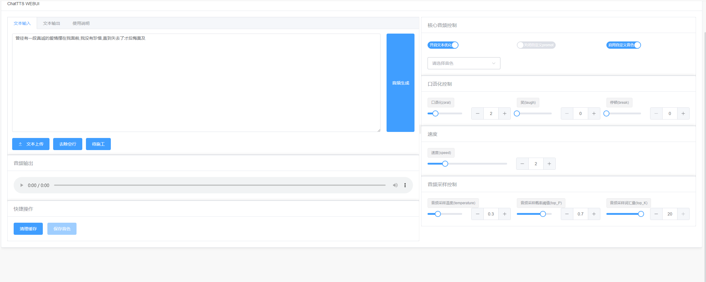
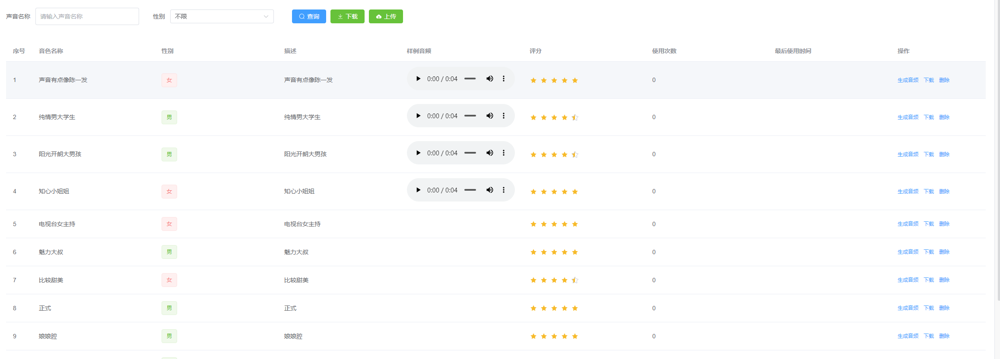

# CHATTS管理系统

基于CHATTTS、GFAST的管理系统

## 特性

- 基于FastAPI提供了api接口
- 基于GO语言,极低的内存占用,本机测试内存占用30M
- 提供了WebUI界面
  - 支持txt文本上传
  - 支持长文本音频生成
  - 支持自定义promot
  - 支持选择自定义音色
    - 音色选择下拉列表默认最近10条音频
    - 支持音色查询

  - 支持音色保存

- 提供了音色管理界面
  - 音色列表管理
  - 音色样例音频快速试听
  - 音色下载为json文件
  - 上传json文件快速添加，不可重名

## 预览

双击exe,访问`http://127.0.0.1:8808/sys`,默认密码`admin 123456`






## 安装

1. 克隆此项目到本地

2. 运行apiServer

   ```bash
   cd apiServer
   phthon main.py
   ```

   自行安装python环境和依赖,推荐3.10

3. 构建管理系统(需要安装npm、GO)

   ```bash
   python build.py
   ```

   会打包生成一个目录,自动初始化目录结构chattts,主程序其中的tts.exe

4. 根据实际情况修改数据库连接

   默认sqlite数据库,无需改动,如果需要改为mysql,参考如下建表语句

   ```
   mysql建表语句存放在resource\data下
   ```

​	5.配置文件在`mainifest/config/config.yaml中`

- mysql ` link:   "mysql:root:123456@tcp(127.0.0.1:3306)/gfast?charset=utf8mb4&parseTime=true&loc=Local"`
- sqlite `link: sqlite::@file(/./db/tts.db)`

tts相关配置

```bash
# ChatTTS
chatTTS:
  # apiurl 
  apiUrl: "http://127.0.0.1:8087"
  # 需要和apiServer一致
  audioTempPath: "./audio_temp"
  # 保存音频文件的目录
  audioSavePath: "./audio"
```

常见错误大都因为目录填写的不对,需仔细排查,如果使用的一键构建脚本无需改动,直接启动apiServer和tts.exe即可


# 参考

- 名词解释参考:https://zhuanlan.zhihu.com/p/703240560
- 默认音色参考:https://github.com/2noise/ChatTTS/issues/238
